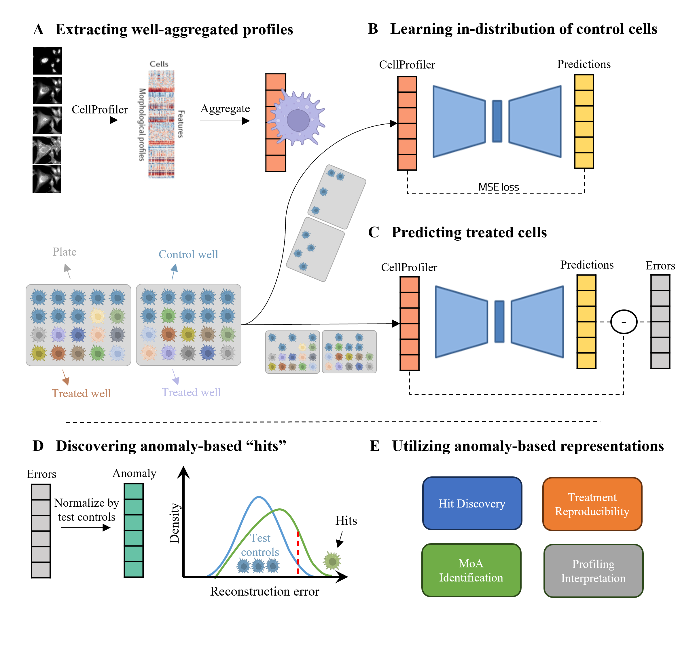

# Anomaly detection for high-content image-based phenotypic cell profiling

High-content image-based phenotypic profiling combines automated microscopy and analysis to identify phenotypic alterations in cell morphology and provide insight into the cell's physiological state. Classical representations of the phenotypic profile can not capture the full underlying complexity in cell organization, while recent weakly machine-learning based representation-learning methods are hard to biologically interpret. We used the abundance of control wells to learn the in-distribution of control experiments and use it to formulate a self-supervised reconstruction anomaly-based representation that encodes the intricate morphological inter-feature dependencies while preserving the representation interpretability. The performance of our anomaly-based representations was evaluated for downstream tasks with respect to two classical representations across four public Cell Painting datasets. Anomaly-based representations improved reproducibility, Mechanism of Action classification, and complemented classical representations. Unsupervised explainability of autoencoder-based anomalies identified specific inter-feature dependencies causing anomalies. The general concept of anomaly-based representations can be adapted to other applications in cell biology.

## Downloading data

All augmented per-well aggregated Cell Painting datasets were downloaded from the Cell Painting Gallery (CPG) (https://registry.opendata.aws/cellpainting-gallery/).

## Project setup and run:

1. Clone this repository.
2. Open cmd/shell/terminal and go to project folder: `cd AnomalyDetectionScreening`
3. Create a conda environment: `conda create -n pytorch_anomaly python=3.10.9`
4. Activate the conda environment `conda activate pytorch_anomaly`
5. Install the required packages: `pip install -r requirements.txt`
5. Run `python ads/main.py`. This script will run the anomaly detection pipeline and subsequent analyses: train the anomaly detection model, calculate percent replicating, train mechanism of action (MoA) and generate SHAP-based anomaly explanations.
6. Run additional notebooks under 'notebooks/' to generate figures and tables.

[comment]: <> (You can automatically download a model from HF using the script `download-model.py`:)

[comment]: <> (    python download-model.py organization/model)

[comment]: <> (For example:)

[comment]: <> (    python download-model.py facebook/opt-1.3b)

[comment]: <> (If you want to download a model manually, note that all you need are the json, txt, and pytorch\*.bin &#40;or model*.safetensors&#41; files. The remaining files are not necessary.)

[comment]: <> (#### GGML models)

[comment]: <> (You can drop these directly into the `models/` folder, making sure that the file name contains `ggml` somewhere and ends in `.bin`.)

[comment]: <> (#### GPT-4chan)

[comment]: <> ([GPT-4chan]&#40;https://huggingface.co/ykilcher/gpt-4chan&#41; has been shut down from Hugging Face, so you need to download it elsewhere. You have two options:)

[comment]: <> (* Torrent: [16-bit]&#40;https://archive.org/details/gpt4chan_model_float16&#41; / [32-bit]&#40;https://archive.org/details/gpt4chan_model&#41;)

[comment]: <> (* Direct download: [16-bit]&#40;https://theswissbay.ch/pdf/_notpdf_/gpt4chan_model_float16/&#41; / [32-bit]&#40;https://theswissbay.ch/pdf/_notpdf_/gpt4chan_model/&#41;)

[comment]: <> (The 32-bit version is only relevant if you intend to run the model in CPU mode. Otherwise, you should use the 16-bit version.)

## Citation

For a complete discussion of our findings please view our preprint:

TBD.

<!-- > Machine learning inference of continuous single-cell state transitions during myoblast differentiation and fusion
Amit Shakarchy, Giulia Zarfati, Adi Hazak, Reut Mealem, Karina Huk, Ori Avinoam, Assaf Zaritsky
bioRxiv 2023.02.19.529100; doi: https://doi.org/10.1101/2023.02.19.529100 -->
[comment]: <> (| Flag                                       | Description |)

[comment]: <> (|--------------------------------------------|-------------|)

[comment]: <> (| `-h`, `--help`                             | Show this help message and exit. |)

[comment]: <> (| `--notebook`                               | Launch the web UI in notebook mode, where the output is written to the same text box as the input. |)

[comment]: <> (| `--chat`                                   | Launch the web UI in chat mode. |)

[comment]: <> (| `--character CHARACTER`                    | The name of the character to load in chat mode by default. |)

[comment]: <> (| `--model MODEL`                            | Name of the model to load by default. |)

[comment]: <> (| `--lora LORA [LORA ...]`                   | The list of LoRAs to load. If you want to load more than one LoRA, write the names separated by spaces. |)

[comment]: <> (| `--model-dir MODEL_DIR`                    | Path to directory with all the models. |)

[comment]: <> (| `--lora-dir LORA_DIR`                      | Path to directory with all the loras. |)

[comment]: <> (| `--model-menu`                             | Show a model menu in the terminal when the web UI is first launched. |)

[comment]: <> (| `--no-stream`                              | Don't stream the text output in real time. |)

[comment]: <> (| `--settings SETTINGS_FILE`                 | Load the default interface settings from this json file. See `settings-template.json` for an example. If you create a file called `settings.json`, this file will be loaded by default without the need to use the `--settings` flag. |)

[comment]: <> (| `--extensions EXTENSIONS [EXTENSIONS ...]` | The list of extensions to load. If you want to load more than one extension, write the names separated by spaces. |)

[comment]: <> (| `--verbose`                                | Print the prompts to the terminal. |)

[comment]: <> (#### Accelerate/transformers)

[comment]: <> (| Flag                                        | Description |)

[comment]: <> (|---------------------------------------------|-------------|)

[comment]: <> (| `--cpu`                                     | Use the CPU to generate text. Warning: Training on CPU is extremely slow.|)

[comment]: <> (| `--auto-devices`                            | Automatically split the model across the available GPU&#40;s&#41; and CPU. |)

[comment]: <> (|  `--gpu-memory GPU_MEMORY [GPU_MEMORY ...]` | Maxmimum GPU memory in GiB to be allocated per GPU. Example: `--gpu-memory 10` for a single GPU, `--gpu-memory 10 5` for two GPUs. You can also set values in MiB like `--gpu-memory 3500MiB`. |)

[comment]: <> (| `--cpu-memory CPU_MEMORY`                   | Maximum CPU memory in GiB to allocate for offloaded weights. Same as above.|)

[comment]: <> (| `--disk`                                    | If the model is too large for your GPU&#40;s&#41; and CPU combined, send the remaining layers to the disk. |)

[comment]: <> (| `--disk-cache-dir DISK_CACHE_DIR`           | Directory to save the disk cache to. Defaults to `cache/`. |)

[comment]: <> (| `--load-in-8bit`                            | Load the model with 8-bit precision.|)

[comment]: <> (| `--bf16`                                    | Load the model with bfloat16 precision. Requires NVIDIA Ampere GPU. |)

[comment]: <> (| `--no-cache`                                | Set `use_cache` to False while generating text. This reduces the VRAM usage a bit with a performance cost. |)

[comment]: <> (| `--xformers`                                | Use xformer's memory efficient attention. This should increase your tokens/s. |)

[comment]: <> (| `--sdp-attention`                           | Use torch 2.0's sdp attention. |)

[comment]: <> (| `--trust-remote-code`                       | Set trust_remote_code=True while loading a model. Necessary for ChatGLM. |)

[comment]: <> (#### llama.cpp)

[comment]: <> (| Flag        | Description |)

[comment]: <> (|-------------|-------------|)

[comment]: <> (| `--threads` | Number of threads to use. |)

[comment]: <> (| `--n_batch` | Maximum number of prompt tokens to batch together when calling llama_eval. |)

[comment]: <> (| `--no-mmap` | Prevent mmap from being used. |)

[comment]: <> (| `--mlock`   | Force the system to keep the model in RAM. |)

[comment]: <> (| `--cache-capacity CACHE_CAPACITY`   | Maximum cache capacity. Examples: 2000MiB, 2GiB. When provided without units, bytes will be assumed. |)

[comment]: <> (| `--n-gpu-layers N_GPU_LAYERS` | Number of layers to offload to the GPU. Only works if llama-cpp-python was compiled with BLAS. Set this to 1000000000 to offload all layers to the GPU. |)

[comment]: <> (#### GPTQ)

[comment]: <> (| Flag                      | Description |)

[comment]: <> (|---------------------------|-------------|)

[comment]: <> (| `--wbits WBITS`           | Load a pre-quantized model with specified precision in bits. 2, 3, 4 and 8 are supported. |)

[comment]: <> (| `--model_type MODEL_TYPE` | Model type of pre-quantized model. Currently LLaMA, OPT, and GPT-J are supported. |)

[comment]: <> (| `--groupsize GROUPSIZE`   | Group size. |)

[comment]: <> (| `--pre_layer PRE_LAYER [PRE_LAYER ...]`  | The number of layers to allocate to the GPU. Setting this parameter enables CPU offloading for 4-bit models. For multi-gpu, write the numbers separated by spaces, eg `--pre_layer 30 60`. |)

[comment]: <> (| `--checkpoint CHECKPOINT` | The path to the quantized checkpoint file. If not specified, it will be automatically detected. |)

[comment]: <> (| `--monkey-patch`          | Apply the monkey patch for using LoRAs with quantized models.)

[comment]: <> (| `--quant_attn`         | &#40;triton&#41; Enable quant attention. |)

[comment]: <> (| `--warmup_autotune`    | &#40;triton&#41; Enable warmup autotune. |)

[comment]: <> (| `--fused_mlp`          | &#40;triton&#41; Enable fused mlp. |)

[comment]: <> (#### FlexGen)

[comment]: <> (| Flag             | Description |)

[comment]: <> (|------------------|-------------|)

[comment]: <> (| `--flexgen`                       | Enable the use of FlexGen offloading. |)

[comment]: <> (| `--percent PERCENT [PERCENT ...]` | FlexGen: allocation percentages. Must be 6 numbers separated by spaces &#40;default: 0, 100, 100, 0, 100, 0&#41;. |)

[comment]: <> (| `--compress-weight`               | FlexGen: Whether to compress weight &#40;default: False&#41;.|)

[comment]: <> (| `--pin-weight [PIN_WEIGHT]`       | FlexGen: whether to pin weights &#40;setting this to False reduces CPU memory by 20%&#41;. |)

[comment]: <> (#### DeepSpeed)

[comment]: <> (| Flag                                  | Description |)

[comment]: <> (|---------------------------------------|-------------|)

[comment]: <> (| `--deepspeed`                         | Enable the use of DeepSpeed ZeRO-3 for inference via the Transformers integration. |)

[comment]: <> (| `--nvme-offload-dir NVME_OFFLOAD_DIR` | DeepSpeed: Directory to use for ZeRO-3 NVME offloading. |)

[comment]: <> (| `--local_rank LOCAL_RANK`             | DeepSpeed: Optional argument for distributed setups. |)

[comment]: <> (#### RWKV)

[comment]: <> (| Flag                            | Description |)

[comment]: <> (|---------------------------------|-------------|)

[comment]: <> (| `--rwkv-strategy RWKV_STRATEGY` | RWKV: The strategy to use while loading the model. Examples: "cpu fp32", "cuda fp16", "cuda fp16i8". |)

[comment]: <> (| `--rwkv-cuda-on`                | RWKV: Compile the CUDA kernel for better performance. |)

[comment]: <> (#### Gradio)

[comment]: <> (| Flag                                  | Description |)

[comment]: <> (|---------------------------------------|-------------|)

[comment]: <> (| `--listen`                            | Make the web UI reachable from your local network. |)

[comment]: <> (| `--listen-host LISTEN_HOST`           | The hostname that the server will use. |)

[comment]: <> (| `--listen-port LISTEN_PORT`           | The listening port that the server will use. |)

[comment]: <> (| `--share`                             | Create a public URL. This is useful for running the web UI on Google Colab or similar. |)

[comment]: <> (| `--auto-launch`                       | Open the web UI in the default browser upon launch. |)

[comment]: <> (| `--gradio-auth-path GRADIO_AUTH_PATH` | Set the gradio authentication file path. The file should contain one or more user:password pairs in this format: "u1:p1,u2:p2,u3:p3" |)

[comment]: <> (#### API)

[comment]: <> (| Flag                                  | Description |)

[comment]: <> (|---------------------------------------|-------------|)

[comment]: <> (| `--api`                               | Enable the API extension. |)

[comment]: <> (| `--public-api`                        | Create a public URL for the API using Cloudfare. |)

[comment]: <> (#### Multimodal)

[comment]: <> (| Flag                                  | Description |)

[comment]: <> (|---------------------------------------|-------------|)

[comment]: <> (| `--multimodal-pipeline PIPELINE`      | The multimodal pipeline to use. Examples: `llava-7b`, `llava-13b`. |)

[comment]: <> (Out of memory errors? [Check the low VRAM guide]&#40;docs/Low-VRAM-guide.md&#41;.)

[comment]: <> (## Presets)

[comment]: <> (Inference settings presets can be created under `presets/` as text files. These files are detected automatically at startup.)

[comment]: <> (By default, 10 presets by NovelAI and KoboldAI are included. These were selected out of a sample of 43 presets after applying a K-Means clustering algorithm and selecting the elements closest to the average of each cluster.)

[comment]: <> ([Visualization]&#40;https://user-images.githubusercontent.com/112222186/228956352-1addbdb9-2456-465a-b51d-089f462cd385.png&#41;)

[comment]: <> (## Documentation)

[comment]: <> (Make sure to check out the documentation for an in-depth guide on how to use the web UI.)

[comment]: <> (https://github.com/oobabooga/text-generation-webui/tree/main/docs)

[comment]: <> (## Contributing)

[comment]: <> (Pull requests, suggestions, and issue reports are welcome. )

[comment]: <> (You are also welcome to review open pull requests.)

[comment]: <> (Before reporting a bug, make sure that you have:)

[comment]: <> (1. Created a conda environment and installed the dependencies exactly as in the *Installation* section above.)

[comment]: <> (2. [Searched]&#40;https://github.com/oobabooga/text-generation-webui/issues&#41; to see if an issue already exists for the issue you encountered.)

[comment]: <> (## Credits)

[comment]: <> (- Gradio dropdown menu refresh button, code for reloading the interface: https://github.com/AUTOMATIC1111/stable-diffusion-webui)

[comment]: <> (- Verbose preset: Anonymous 4chan user.)

[comment]: <> (- NovelAI and KoboldAI presets: https://github.com/KoboldAI/KoboldAI-Client/wiki/Settings-Presets)

[comment]: <> (- Code for early stopping in chat mode, code for some of the sliders: https://github.com/PygmalionAI/gradio-ui/)
